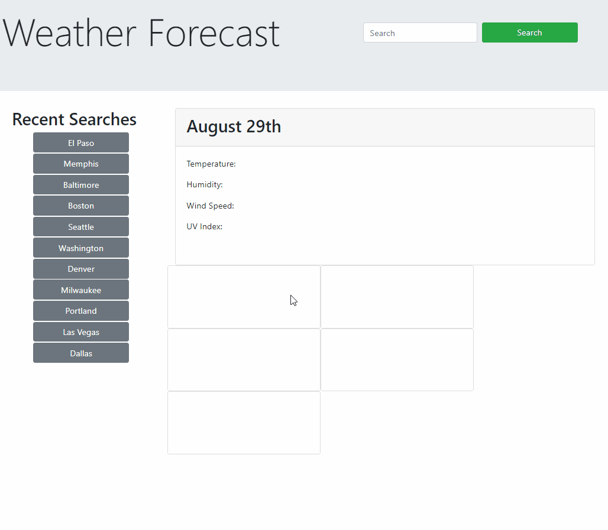

# Weather Forcast

This weather applicattion was a great way to practice working with APIs. The purpose was to update the DOM with relevent weather information based on a user's search. 

## Objective:

- Buiild and style a dynamic web page
- Allow users to search for any US city and be presented with relvent weather information
- Save the user's search history on the page, but only store valid city names
- Let users click on the recent search to get that data displayed again, but not have more than 10 items saved in their search history

[Work Day Scheduler](https://diegopie.github.io/java-script-timed-quiz/) is hosted on GitHub pages. 

## Outcome: 

It took my some time to get APIs wrapped around my head and this project was a great way to get comforatable with them. There are more complexities to API's that i'd like to explore, and my CSS skills definitely need some polish, but I am happy with the results and am eager to apply what I've learned. 

## Collaborators:

A very special thank you to the Bootstrap, Moment JS, and OpenWeather teams for making this application possible. 

Here are some key web pages that helped build this project:
(https://openweathermap.org/api)

Much thanks to [Christian Boswell](https://github.com/cboswel1) for isnpiring how to create my five day forcast

This application was authored by [Diego Hernandez](https://github.com/Diegopie)